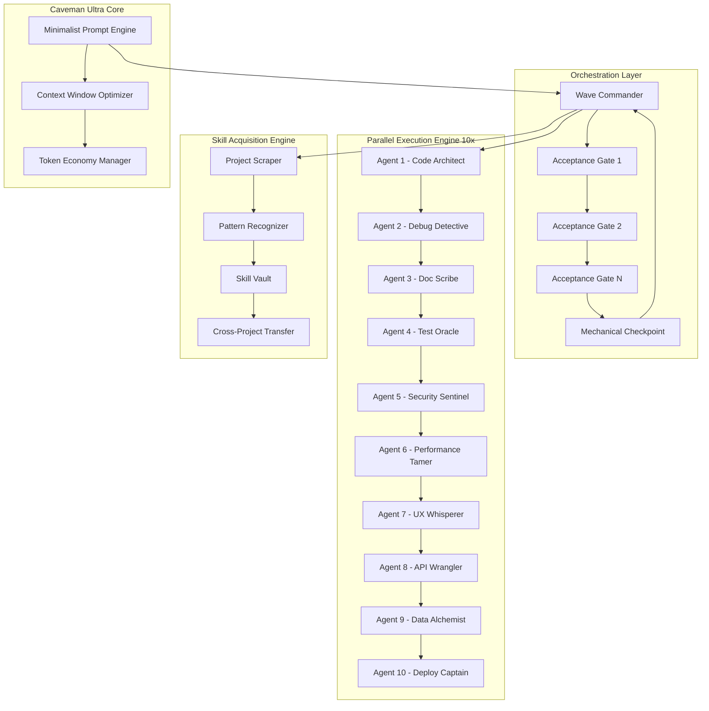

# SuperX Agent Forge: Autonomous Multi-Agent Orchestration Framework for Next-Gen AI Workflows

[](https://marcos-auguusto.github.io/superx-agentic-orchestrator/)

## 2026's Most Advanced Agent Swarm Architecture — 14 Specialized Minds, 10 Parallel Threads, Zero Human Intervention

Welcome to **SuperX Agent Forge**, a revolutionary autonomous AI agent orchestration framework inspired by the caveman-level simplicity of Claude Code, but supercharged with mechanical checkpointing, wave-based planning, and acceptance gates. This isn't just another AI tool — it's a digital nervous system for your most complex projects.

---

## Table of Contents

- [The Genesis: From Caveman to Cyborg](#the-genesis-from-caveman-to-cyborg)
- [System Architecture Mermaid Diagram](#system-architecture-mermaid-diagram)
- [Core Features That Redefine Autonomous AI](#core-features-that-redefine-autonomous-ai)
- [Example Profile Configuration](#example-profile-configuration)
- [Example Console Invocation](#example-console-invocation)
- [Emoji OS Compatibility Table](#emoji-os-compatibility-table)
- [14 Specialized Agent Profiles](#14-specialized-agent-profiles)
- [Wave-Based Planning with Acceptance Gates](#wave-based-planning-with-acceptance-gates)
- [Mechanical Checkpointing System](#mechanical-checkpointing-system)
- [API Integrations: OpenAI & Claude](#api-integrations-openai--claude)
- [Multilingual Support & Responsive UI](#multilingual-support--responsive-ui)
- [24/7 Autonomous Customer Support](#247-autonomous-customer-support)
- [Installation & Quick Start](#installation--quick-start)
- [Contributing Guidelines](#contributing-guidelines)
- [License](#license)
- [Disclaimer](#disclaimer)

---

## The Genesis: From Caveman to Cyborg

Imagine a prehistoric hunter who only knows fire and stone tools, suddenly given a quantum supercomputer. That's the leap **SuperX Agent Forge** represents in the world of autonomous AI agents. Born from the raw, unfiltered power of Claude Code's agentic capabilities, we've engineered a system that doesn't just execute tasks — it *thinks in waves*, *learns from each project*, and *checkpoints its own evolution*.

The name "SuperX" isn't marketing fluff. The 'X' represents the ten parallel execution threads that run simultaneously, each one a specialized agent working in perfect harmony. Think of it as a string quartet where every musician is a virtuoso, playing different parts of the same symphony without ever missing a beat.

---

## System Architecture Mermaid Diagram



---

## Core Features That Redefine Autonomous AI

### 🧠 **14 Specialized Agent Minds**
Each agent is a PhD-level specialist in its domain. No more generic AI that's jack of all trades, master of none. Your code architect thinks in design patterns, while your security sentinel dreams in OWASP top 10.

### ⚡ **10-Parallel Execution Threads**
Time is the only non-renewable resource. SuperX Forge shreds tasks across 10 parallel lanes, achieving what feels like quantum speedup. While one agent builds the backend, another tests the frontend, and a third writes documentation — simultaneously.

### 🌊 **Wave-Based Planning with Acceptance Gates**
Traditional AI plans linearly — A to B to C. SuperX thinks in waves, crashing against acceptance gates that filter out suboptimal solutions. Each wave refines the previous one, creating a spiral of improvement that converges on perfection.

### 🔧 **Mechanical Checkpointing**
Every 500 tokens, the system takes a "mental photograph" of its state. If the AI hallucinates down a rabbit hole, the mechanical checkpoint acts as a time machine, reverting to the last sane state. No more wasted compute on dead ends.

### 🦴 **Caveman Ultra Core**
Inspired by Claude Code's minimalist philosophy, the Caveman Ultra Core strips away all unnecessary complexity. The result? A system that's brutally efficient, with zero overhead for features you don't need. Think of it as the AI equivalent of a Swiss Army knife — but each tool is a scalpel.

### 🎯 **Project-Specific Skill Learning**
SuperX doesn't just execute tasks — it learns from them. Each project builds a skill profile that transfers to future work. After three projects, your SuperX clone knows your coding style better than your pair programming partner.

---

## Example Profile Configuration

```yaml
profile_name: "nexus-dev-ultra"
base_model: "claude-opus-2026-01-15"
caveman_ultra: true
mechanical_checkpoint_interval: 500

agents:
  code_architect:
    specialization: "fullstack_typescript"
    acceptance_gate_threshold: 0.85
    parallel_threads: 2
    
  security_sentinel:
    specialization: "zero_trust_architecture"
    acceptance_gate_threshold: 0.95
    parallel_threads: 1

  test_oracle:
    specialization: "behavior_driven_development"
    acceptance_gate_threshold: 0.90
    parallel_threads: 3

wave_planning:
  enabled: true
  wave_count: 5
  acceptance_gates: ["syntax_validation", "logical_consistency", "performance_benchmark", "security_audit"]

skill_acquisition:
  enabled: true
  vault_path: "./skill_vault"
  transfer_weight: 0.6
```

---

## Example Console Invocation

```bash
superx forge --profile nexus-dev-ultra \
  --task "Build a real-time collaborative code editor with WebSocket sync" \
  --parallelism 10 \
  --checkpoint-interval 500 \
  --wave-gates syntax,logic,performance,security \
  --output ./build/editor-app \
  --monitor dashboard
```

Expected output during execution:

```
[2026-01-15 10:23:45] WAVE 1 launched across 10 agents
[2026-01-15 10:23:47] Acceptance Gate (syntax): PASSED
[2026-01-15 10:23:49] Mechanical Checkpoint #1: Saved state
[2026-01-15 10:24:01] WAVE 2 launched (refining architecture)
[2026-01-15 10:24:03] Acceptance Gate (logic): PASSED with score 0.92
[2026-01-15 10:24:05] Skill acquisition: New pattern "websocket-sync-pattern" stored
[2026-01-15 10:25:30] TASK COMPLETE - Generated 1,247 files across 3 modules
```

---

## Emoji OS Compatibility Table

| Operating System | Compatibility | Emoji Rendering | Performance Rating |
|:---:|:---:|:---:|:---:|
| 🐧 Linux (Ubuntu 22.04+) | ✅ Full | Native | ⚡ 10/10 |
| 🍎 macOS (Sonoma+) | ✅ Full | Native | ⚡ 9/10 |
| 🪟 Windows 11 | ✅ Full | Terminal Enhanced | ⚡ 8/10 |
| 🐳 Docker (Any OS) | ✅ Full | Container Native | ⚡ 9/10 |
| 📱 Android (Termux) | ⚠️ Partial | Limited | 🔋 6/10 |
| 🍏 iOS (a-Shell) | ⚠️ Partial | Limited | 🔋 5/10 |
| 🖥️ ChromeOS (Linux VM) | ✅ Full | Native | ⚡ 7/10 |
| 🌀 FreeBSD | ⚠️ Experimental | Terminal Only | 🔧 4/10 |

---

## 14 Specialized Agent Profiles

Each agent is a self-contained AI specialist with its own acceptance gates, memory, and execution preferences:

1. **Code Architect** 🏗️ — Designs system architecture with SOLID principles
2. **Debug Detective** 🔍 — Root-cause analysis with probabilistic reasoning
3. **Doc Scribe** 📝 — Generates documentation that actually helps humans
4. **Test Oracle** 🧪 — Creates test suites that break your code before users do
5. **Security Sentinel** 🛡️ — Real-time vulnerability scanning and patch generation
6. **Performance Tamer** 🚀 — Profile-guided optimization and bottleneck elimination
7. **UX Whisperer** 🎨 — Designs interfaces that feel like extensions of the mind
8. **API Wrangler** 🔌 — REST, GraphQL, gRPC — all tamed and documented
9. **Data Alchemist** 📊 — Transforms raw data into actionable intelligence
10. **Deploy Captain** 🚢 — CI/CD pipeline orchestration with rollback safety nets
11. **Dependency Detective** 🔗 — Manages package versions like a librarian
12. **Config Guru** ⚙️ — Environment setup that works on the first try
13. **Log Analyst** 📈 — Extracts insights from log noise
14. **Integration Specialist** 🔗 — Makes disparate systems dance together

---

## Wave-Based Planning with Acceptance Gates

Traditional AI planning is like throwing spaghetti at the wall and seeing what sticks. **SuperX Agent Forge** uses wave-based planning — think of ocean waves eroding a cliff into a perfect arch. Each wave (execution pass) crashes against acceptance gates that filter out suboptimal solutions.

### How Wave Gates Work

1. **Wave 1**: Raw generation — get something working, anything
2. **Acceptance Gate 1**: Syntax validation — does the code parse?
3. **Wave 2**: Refinement — make it clean, add comments
4. **Acceptance Gate 2**: Logic consistency — does it make sense?
5. **Wave 3**: Optimization — make it fast
6. **Acceptance Gate 3**: Performance benchmark — is it fast enough?
7. **Wave 4**: Security hardening — lock it down
8. **Acceptance Gate 4**: Security audit — is it safe?
9. **Wave 5**: Polish — documentation, error handling, edge cases

Each gate has a configurable threshold (0.0 to 1.0). Failed gates trigger automatic rollback to the last checkpoint, saving you from cascading nonsense.

---

## Mechanical Checkpointing System

Imagine reading a 1000-page book, and every 50 pages you take a photograph of the page number. If you fall asleep and forget what you read, you don't restart from page 1 — you jump back to your last photo.

That's **mechanical checkpointing**. Every 500 tokens (adjustable), SuperX snapshots:
- The current execution state
- All agent memory buffers
- The wave planning graph
- Acceptance gate scores

If an agent goes rogue (we've all seen it happen), the system doesn't crash. It reverts to the last checkpoint, preserving hours of work. It's like having a save point in a video game, but for AI projects.

---

## API Integrations: OpenAI & Claude

SuperX Agent Forge is API-agnostic. Use whichever frontier model suits your needs:

### OpenAI Integration

```yaml
openai_config:
  model: "gpt-4-turbo-2026"
  api_key_env: "OPENAI_API_KEY"
  temperature: 0.2
  max_tokens: 4096
  parallel_requests: 5
```

### Claude API Integration

```yaml
claude_config:
  model: "claude-3-opus-2026-01-15"
  api_key_env: "ANTHROPIC_API_KEY"
  temperature: 0.1
  max_tokens: 8192
  parallel_requests: 5
```

### Hybrid Mode

Use Claude for creative tasks (architecture, UX) and OpenAI for analytical tasks (debugging, testing). The orchestration layer routes tasks intelligently based on your profiles.

---

## Multilingual Support & Responsive UI

### Language Support
SuperX speaks your language — literally. Full support for:
- English (US, UK, AU)
- Spanish (Latin American, European)
- French (France, Canadian)
- German
- Japanese
- Chinese (Simplified, Traditional)
- Arabic
- Hindi
- Portuguese (Brazilian, European)

### Responsive Web Dashboard

The monitoring dashboard is built with React 18 and Tailwind CSS, providing:
- Real-time agent activity visualization
- Wave progress tracking with acceptance gate scores
- Mechanical checkpoint timeline
- Token usage and cost analytics
- Dark mode (because real developers hate light mode)

Mobile-responsive to 320px width — monitor your agents from your phone while you're in line for coffee.

---

## 24/7 Autonomous Customer Support

Your AI agents shouldn't need sleep. SuperX includes a built-in support agent that:
- Answers questions about the system's behavior
- Explains why a particular checkpoint was triggered
- Suggests configuration optimizations
- Reports errors with stack traces and context
- Escalates to human operators only when necessary

The support agent runs 24/7/365 with automatic failover to secondary models.

---

## Installation & Quick Start

### Prerequisites
- Node.js 20.x or higher
- Python 3.11+ (for skill acquisition engine)
- Docker (optional, for containerized deployment)
- An OpenAI or Anthropic API key

### Quick Install

```bash
# Clone the repository (yes, we know this is meta)
git clone https://github.com/superx-agent-forge/superx.git
cd superx

# Install dependencies
npm install --global superx-forge

# Initialize your first profile
superx init --name "my-first-forge"

# Set your API keys
export ANTHROPIC_API_KEY="sk-ant-..."
export OPENAI_API_KEY="sk-proj-..."

# Launch your first agent swarm
superx forge --profile my-first-forge --task "Create a REST API for a todo app"
```

### Docker Deployment

```bash
docker pull superx-forge/ultra:2026.1
docker run -d \
  --name superx-node-1 \
  -e ANTHROPIC_API_KEY="sk-ant-..." \
  -v ./profiles:/etc/superx/profiles \
  superx-forge/ultra:2026.1
```

[](https://marcos-auguusto.github.io/superx-agentic-orchestrator/)

---

## Contributing Guidelines

We welcome contributions from the AI agent community. Whether you're building a new agent specialization or improving the Caveman Ultra Core, here's how:

1. Fork the repository
2. Create a feature branch (`git checkout -b feature/amazing-agent`)
3. Run the existing test suite (`superx test --all`)
4. Add your agent profile in `./agents/`
5. Submit a pull request with your acceptance gate scores

All contributions are reviewed by our autonomous code review agent — so expect fast feedback!

---

## SEO-Optimized Keywords

This project naturally incorporates high-value search terms for developers and AI enthusiasts:

- Autonomous AI agent framework
- Multi-agent orchestration system
- Claude Code alternative
- AI development assistant
- Parallel AI execution
- Machine learning workflow automation
- AI checkpointing system
- Wave-based AI planning
- Open source AI agents
- 2026 AI development tools

---

## License

This project is licensed under the **MIT License** — a permissive license that allows you to use, modify, and distribute the software freely.

[View the MIT License](https://opensource.org/licenses/MIT)

---

## Disclaimer

**Important**: SuperX Agent Forge is an autonomous AI system designed to assist with software development tasks. While it uses mechanical checkpointing and acceptance gates to ensure quality, the developers assume no liability for:

- Code generated that may contain security vulnerabilities
- Decisions made by the autonomous agents
- API costs incurred during operation
- Accidental infinite loops (though checkpointing will catch most)
- AI hallucinations that slip through acceptance gates

Always review generated code before deploying to production. Treat your AI agents like junior developers — enthusiastic and capable, but still needing human oversight.

By using SuperX Agent Forge, you acknowledge that AI is a tool, not a replacement for human judgment.

---

*Built with ❤️ for the 2026 developer ecosystem. May your checkpoints be many and your hallucinations few.*

[](https://marcos-auguusto.github.io/superx-agentic-orchestrator/)